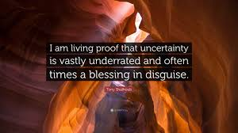

# A Note on Proof and Certainty

I am not writing systematic theology. I commend Grudem’s “Systematic Theology” if you are looking for that resource. I am writing down what I believe I have discovered on a personal journey of exploration. My standard for what counts as a provisional “law” is fourfold: it lines up with scripture; the Spirit of Truth witnesses to it; it is recognized (at least partially) by tradition and a community of practitioners; and it is testable in the natural, meaning it produces observable results in the lives of people who operate according to it.

Along the way, I will give you my confidence level on each major claim. That is not false modesty. It is intellectual honesty about the fact that I am exploring terrain that has not been fully mapped, and I’d rather tell you I’m at 70% than pretend I’m at 100% when I’m not. The early scientists who first discovered natural laws held them provisionally, too, and they were right to do so.

Here's what I'm actually doing when I assign a confidence percentage to a claim:

**Counting independent lines of evidence**. A claim supported by multiple scriptural texts that approach it from different angles, plus corroborating patterns in your own observed experience, plus conceptual coherence with adjacent claims, gets higher confidence than a claim resting on a single passage or a single analogy. The Faith Generation law (75%) has Romans 10:17 as its spine, but the willingness-to-obey modifier is an inference from the pattern across John 7:17, the parable of the Sower, and my decades of observation — not a direct proof. So 75%, not 90%.

**Weighting the type of evidence.** Direct propositional statements in scripture (explicit cause-and-effect claims like John 7:17) get more weight than structural inferences ("this cluster behaves like a gateway, therefore it is one"), which get more weight than analogical reasoning from physics or systems dynamics. The resonance model of prayer (70%) is compelling and consistent across multiple texts, but it rests heavily on analogy, so its ceiling is lower, regardless of how much I like the model.

**Flagging where my interpretation is doing the work**. The directional arrows in the Faith-Hope-Love triad (80%) have good scriptural grounding, but the specific causal direction of each arrow is my interpretation of what the texts imply, not what they state. The confidence number is marking that distinction, "I believe this is right, and here's why, but I am doing interpretive work that someone else could contest."

**Anchoring to a reference case**. The Sin Blockage Law (90%) is one of the highest-confidence laws in Vol 2 because it has explicit positive and negative scriptural statements, bidirectional confirmation, millennia of consistent theological tradition, and direct experiential confirmation from many people over many decades. That becomes the 90% anchor. Everything else gets calibrated relative to it: "Is this as well-supported as the sin blockage law? More? Less? By how much?"

**What the numbers don't mean**. They are not Bayesian posteriors calculated from a principled prior and updated on evidence. They are not reproducible in the sense that another careful reader would necessarily arrive at the same number. They are epistemic signals, shorthand for "here is roughly how much weight I put on this before it is tested, refined, and challenged by the community." The 40% on the spiritual force equation is not saying "this is probably wrong." It is saying "the structure may be right, but the specific mathematical form is genuinely open — don't build on this particular formulation yet."

Wayne Grudem’s approach in Systematic Theology uses a qualitative rather than numerical confidence structure — distinguishing between what scripture clearly teaches, what can be reasonably inferred from it, and what is speculative or provisional. I want to acknowledge that this may be the more honest framework, even though I have retained the numerical system throughout these volumes. The numbers are useful as relative signals — 85% means more solid than 70% — but they cannot bear the weight of precise calibration that their format implies. If you find the numerical precision frustrating or misleading, feel free to translate: 85–90% means ‘clearly taught or directly confirmed’; 70–80% means ‘reasonably inferred, needs community testing’; below 70% means ‘speculative — interesting enough to pursue, not solid enough to build on.’ The qualitative translation is probably more honest than the number itself. In any case, practically the assignment is useful for me in that the 85+% are things that I operate in as best I can and use as true, such that when disconfirming data shows up, I consider alternative explanations before revising my certainty. The next level I hold loosely in my life, recognizing that lower certainty. The third level is really just ongoing exploration and research, seeking further data and scriptural interpretation.

The deeper answer is that assigning precise numbers to theological claims carries a risk of false precision that the numbers themselves are trying to guard against. The goal is not to make the investigation look more rigorous than it is — it is to make the actual degree of rigor visible, including where it is low.

These four criteria are what the governance framework in Volume 6 names, in its more formal vocabulary, as independent scriptural lines, experiential corroboration, conceptual coherence, and consistency with tradition. The correspondence is: scriptural grounding is what the governance documents call independent scriptural lines; the Spirit’s witness (the interior, personal confirmation a serious disciple learns to recognize) is what the governance documents, in a more public form, call experiential corroboration; testability in the natural — producing observable results in the lives of people who live by the claim — is what the governance documents call conceptual coherence when combined with Volume 4’s reason-applied-carefully test; and community recognition is what the governance documents call consistency with tradition, broadened to include the recognition of the present community of practitioners alongside the witness of the tradition across time. I use less formal vocabulary throughout this Introduction because it is closer to how the criteria actually operate in my life; the governance vocabulary is better suited to the contributor guide, where proposed refinements are evaluated against the same four factors in a public, reviewable form.

These four criteria have a second life in Volume 6. The contributor guide requires every proposed refinement to the core record to address the same four factors — independent scriptural lines, experiential corroboration, conceptual coherence, and consistency with tradition — in its own four-factor derivation, and a proposal that leaves any of the four blank is returned for strengthening rather than reviewed. What I have been doing privately for twenty years is, in the governance model, made into a hard requirement for anyone who wants to affect the core record. The disciplines are the same; the only change is that they now apply to the community as well as to me.

My consideration of tradition has been an interesting challenge for me, in and of itself. Nicodemus knew scripture better than I ever will, and surely knew his traditional interpretations better than I know mine. And Jesus challenged him for not seeing deeper. What I’d like to do here is try to see deeper, in some cases beyond what my current tradition holds. An interesting challenge because there are thousands of years of doctrine development and manifold thousands of years of serious people studying these topics deeply. Again, sounds arrogant, but it's such a fun journey. From any contributor, I ask for the same openness to exploration and reaching out, rather than just offering their current tradition and doctrine. I do understand that it is a challenge.

There have been many laws derived, rightly, from scripture, such as sowing and reaping, unforgiveness, etc. I’m not trying to do a holistic index of all laws developed so far. I’m just exploring areas I am led to explore and making connections in areas I have experience in.

I am writing all this from a Western (actually US) Christian Protestant personal viewpoint. When I reflect on my own journey, I find parts of Reformed, Evangelical, Charismatic, and Mystical Christian viewpoints all mixed together. I am trusting that a scriptural grounding and analysis will keep this all pointed to real, useful, and spiritual insights.
