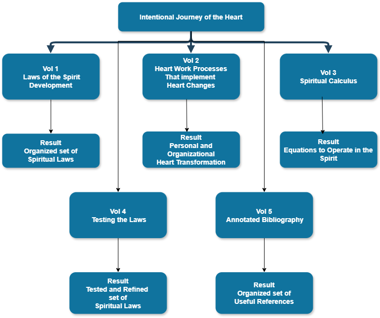
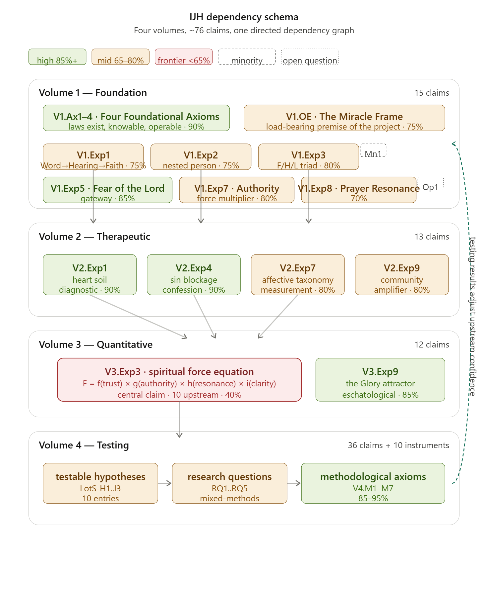
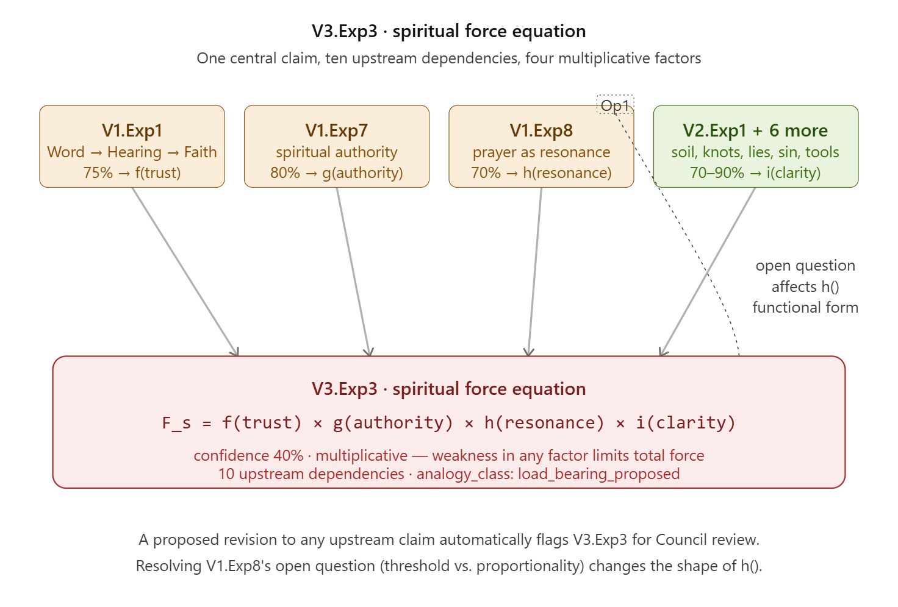

# Overview of the Work

The core work is in five volumes, with a sixth providing the governance framework under which the work is stewarded, refined, and extended beyond my own participation:

This all looks organized and neat, but the development has been messy, to say the least. Different parts have been developed at different times and rates over the years, so there are gaps and inconsistencies, some of which I can’t even see anymore.

Vol 1 is the basic development of laws or relationships I see in scripture, along with my personal assessment of certainty. This volume includes a draft Table of Periodic Elements (like the one for chemical elements) that offers an organizing principle for identifying gaps and predicting undiscovered (at least by me) additional laws.  Vol 2 uses these laws to address the heart work that helps me internalize them. The progression of that internalization process is the work of the Holy Spirit in me, and the processes described are just ways to open myself up to that work. The Affective Taxonomy, which describes the observable component of that progress, is foundational to this volume. Vol 3 then goes deeper, proposing ways to translate relationships and laws into equations, seeking the clarity of formal dynamics to describe how spiritual forces actually operate. This step is, without a doubt, one of the most challenging in this discussion. I suggest an approach that I find interesting but needs testing by others more competent than I. Vol 4 proposes a way to test all this in real life. If the first three volumes change, then of course, the testing needs to adapt. This volume has grown considerably from its origins as a draft and now offers a structured testing scaffolding — including individual and small group protocols, assessment instruments, and a formal research program design. It remains explicitly dependent on Volumes 1–3 and should be revised if those volumes change significantly.

Volume 5 is one of the most important because it is a key to all the help and insight I have had along the way. It is an annotated reference list for anyone who wants to, in part, follow my trail of crumbs on my journey to this current version. These are important references, but by no means all the references I could invoke. As Newton said, "If I have seen further than others, it is by standing on the shoulders of giants."

Volume 6 is new and different in character. Where Volumes 1–5 are my personal record of what I believe the Lord has shown me, Volume 6 is the governance framework under which this work can be stewarded, extended, refined, and, where necessary, corrected by others. It contains the governance model itself, a contributor guide, a proposal template, a succession letter, the Council paper introducing the body that will steward the work, the claim registry that encodes every proposition in Volumes 1–4 with its confidence level and dependencies, and a dependency diagram showing how the claims relate. I wrote Volume 6 in a more institutional voice on purpose. It is meant to outlast me and serve people who will come to this work long after I am gone. The Council of Stewards, as it describes, is how this record stays honest once it is no longer just me keeping it honest. Here is a visual sample of how things hang together:

And one of the detailed dependencies is visually presented. Both of these are in Vol 6 Governance.

Documents that I have developed, but not yet fully incorporated, are included as appendices or attachments. Each offers a future trail for deeper investigation.

Alongside the five volumes, six companion papers have grown up as part of the same exploration. I call them the Formation Documents, and they are some of the research I have done, formalized as academic papers. The Theological Anthropology paper (TA) is the foundational one — it examines what scripture means by heart, spirit, soul, and mind, and argues that each is distinct and trainable; the three taxonomies that follow are built on its framework. The Heart Formation Theology paper (HFT) takes the Affective Taxonomy of Krathwohl, Bloom, and Masia and maps it onto the Parable of the Sower, proposing trust in scripture as the right test case for measuring heart formation. The Soul and Spirit Taxonomies paper (SST) proposes five-stage developmental maps for both the soul and the spirit. The Model of Spiritual Formation for Individuals and Small Groups (MSFIG) is the most comprehensive of the five — it integrates all three taxonomies with Old and New Testament formation theology and extends them to small groups and congregations. The Formation Companion paper (FC) is the fifth one — it proposes the person who facilitates this formation in others as a synthesis role drawing on four established Christian spiritual care traditions, with a three-level developmental progression and a capstone competency of real-time mode-switching. The sixth paper, Heart Formation Measurement Theory (HFMT), explains how the core affective taxonomy can be applied and measured across scales, starting at the individual level, then the small group, then the church, then the denomination, and finally the one, holy, catholic, and apostolic church. This directly addresses the need for structure and accountability at each level. Practically, these documents and the small groups that have been the test bed for development have all been under the spiritual authority of my local church and pastor. I really understand the need for being under authority and have made sure this was true about me personally, and any small group I was working with was also under authority.

These papers don’t replace the five volumes; they run alongside them. The volumes ask how the spiritual laws work. The Formation Documents ask what it looks like, from the inside, to be formed by them. You’ll find them in full in Volume 5, References. Throughout Volumes 1–3, I’ll point you to the specific connections in callout boxes.

There is a Master Law List of Explorations and the resulting proposed laws in the appendix of Vol 3.
