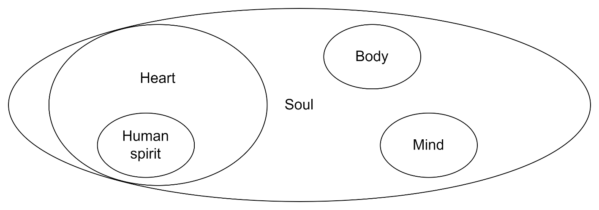

# Second Exploration: My Spirit, Heart, Soul, and Body

## Why This Matters
Before I can describe the laws that govern how things work in me, I need to understand the components. Most of us use spirit, heart, soul, and mind interchangeably — but if they are actually different things with different functions, then that sloppiness is costing us a great deal of clarity. This exploration is about getting the topology right.

## The Proposed Structural Relationship
***Mark 12:29-30 (ESV)***

*"Jesus answered, 'The most important is: Hear, O Israel: the Lord our God, the Lord is one. And you shall love the Lord your God with all your heart and with all your soul and with all your mind and with all your strength.'"*

My working hypothesis is that these are real parts of me. My starting hypothesis: my spirit is a subset of my heart; while my heart, my mind, and my body are component pieces of my soul. I understand this as a hierarchy with my soul, as scripture says, is saved, at the top, and that includes heart, mind, and body. My spirit is a subset of my heart because that’s the part in contact with the Holy Spirit; in fact, my thought is that’s where the Holy Spirit hangs out when he comes to live with me. This is grounded in the question, if God cannot abide sin, how can he hang out with me, certainly a sinner. I see being born again as awakening to the desire to be in communication with God, and that part of my spirit is then holy, which actually means being set apart to God. So that part of me that wants to hear God is where the Holy Spirit comes to hang out. Watchman Nee (The Spiritual Man) does a good job of discussing the tension that arises when my spirit listens to God, my body is in the world, and my mind is the battleground.

I am aware this model sits in tension with both the dichotomist and trichotomist positions in systematic theology. Grudem’s careful engagement with this question in Systematic Theology (Ch. 23) lands on a functional dichotomy — soul and spirit referring to the same immaterial part of persons, used interchangeably in scripture. My model departs from that: I propose a real functional distinction among spirit, heart, soul, and body, with soul as the comprehensive integrating entity rather than the spiritual component alone. The key texts I would ask a systematic theologian to examine with me are 1 Thess. 5:23, which explicitly distinguishes among the three (spirit, soul, body), and Heb. 4:12, which speaks of the Word dividing soul from spirit as if they were separable. I hold this model at 75% in part because I am not certain the systematic tradition has fully resolved the question this distinction is meant to answer.

If this is right, it has immediate practical implications. My spirit is where the Holy Spirit comes to reside when I am born again — the innermost sanctified space, the place of communion with God. My heart is the next layer — the real inner man, the soil of the parable of the Sower. The state of my heart determines what happens with the seed of the Word. My body is my interface with the world, and my soul is the integrating part that is saved and lives forever in his presence.

## What This Explains
The containment structure explains several things that have been fuzzy for me. It explains how I can be "saved" (my spirit is born again and in communion with God) while still needing to "work out my salvation"—there is more of me, in the outer layers, that is still being conformed to Christ. It explains why transformation works from the inside out: changing behavior without changing the heart is superficial and doesn’t hold.

I also understand this from 1 Cor. 3:12-15, where the gold, silver, and precious stones of my life survive the fire (which I think is me standing before a holy God). The wood, hay, and stubble are burned up. To the extent my spirit, heart, mind, and body are separated to God, they are holy and desire to be in his presence forever. The thief on the cross had only a thin sliver of that desire to be with Jesus, but he was saved, and that part that wanted to be with Jesus loves that communion.

A word about what I mean when I say the soul is saved. I am using "saved" in the forensic sense — the soul is the entity that stands before God, declared righteous because of Christ. That is settled the moment I am born again. But the soul is also in process. The same soul that is already positionally saved is simultaneously being sanctified — worked on, broken open, healed, and reformed by the Spirit over a lifetime. When I talk later about soul-disorder or stages of soul development, I am not questioning the completeness of justification. I am describing the experiential, formational work that happens inside the already-declared-righteous soul. Both are true. The legal transaction is done; the interior renovation is ongoing. That is what working out your salvation with fear and trembling looks like from the inside.

What remains an open question is the precise relationship between heart, mind, and soul. I am at about 75% certainty on the overall structure. This needs more work.

**Proposed Law (Structural): The components of a person form a nested containment structure: spirit (innermost) is a subset of my heart, while the heart, mind, and body are subsets/components of the soul. Each outer layer contains and is influenced by all inner layers. Transformation that does not reach the spirit and heart is superficial; lasting change always works from the inside out.**

**Certainty: 75%   ***Consistent with the Mark 12 structure and the parable of the Sower. Additional scriptural support: 1 Thess. 5:23 (ESV) — “Now may the God of peace himself sanctify you completely, and may your whole spirit and soul and body be kept blameless at the coming of our Lord Jesus Christ” — distinguishes all three components explicitly and supports the layered structure. The heart-mind-soul distinction remains the least resolved question in this exploration.*

**FORMATION DOCUMENT CONNECTION: ***The nested containment structure (spirit within heart within soul, which contains my mind and body) established here is the structural map on which all three formation taxonomies in SST are plotted. SST’s spirit taxonomy develops the innermost layer; the soul taxonomy develops the outer layer; and HFT’s heart taxonomy develops the layer where desire and motivation live — what Willard calls the direction of the will. SST makes explicit what this law implies but does not develop: each outer layer has its own developmental logic and its own relationship to the Spirit’s work, so that transformation that reaches only the mind layer without penetrating to the heart and spirit is **structurally incomplete regardless of its behavioral expression. SST also addresses the least-resolved question flagged in this Exploration’s Certainty statement — the heart-mind distinction — proposing that the soul is the integrating faculty (the entity that holds the whole person together) while the heart is the motivational faculty (the seat of desire and the direction of will). The Theological Anthropology paper (TA) is the paper where this functional distinction was first worked out from scripture and the tradition — its engagement with Kelly, Fokin, Cooper, Grudem, Willard, Moreland, and Nee, truth-tested with Kahneman’s System 1/System 2 research via the Powlison and Trentham protocols, produces the integrated model that underwrites the spirit-within-heart-within-soul structure proposed in this Exploration. TA sits first among the five Formation Documents in Vol 5 because HFT and SST both build on its definitions.*
