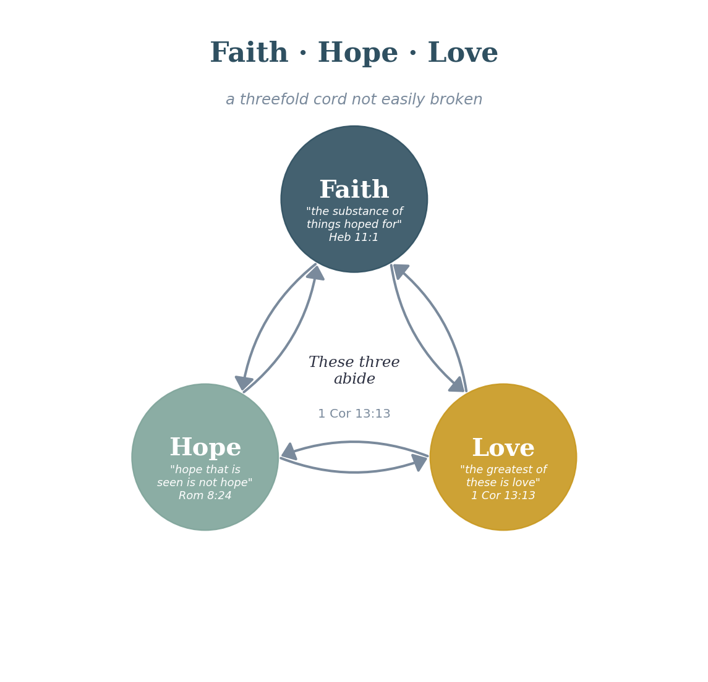

# Third Exploration: The Relationship of Faith, Hope, and Love

## The Starting Point
***1 Cor. 13:13 (ESV)***

*"So now faith, hope, and love abide, these three; but the greatest of these is love."*

Paul identifies these three as eternal; they will abide when other things have passed away, including knowledge. That alone makes them worth special attention. They are not merely virtues or disciplines. They are the permanent structural elements of a life lived in God. My exploration here is about what the relationship among them actually looks like, and what the directional arrows are.

## Defining the Elements
Faith, as I use it throughout these explorations, is trust, pistis in Greek. It is a present-tense orientation: I trust this person or this word right now, enough to act on it.

Hope, as Derek Prince put it so well, is a confident expectation of future good. It is faith extended into the future tense. Where faith says, "I trust now," hope says, "I expect good ahead." The connection between faith and hope is the time axis.

Love is connection, in all its forms. Agape love is the will to the good of the other, independent of feeling. It connects me to God and to others in a way that makes the rest of the spiritual life possible.

## The Directional Relationships
Here is what I have worked out about the arrows, and I want to be precise because the direction matters enormously:

- Faith → Hope: My present trust in God generates confident expectation about my future. Without faith, hope collapses into wishful thinking. Faith is the root; hope is the fruit that grows on that root extended into the future.
- Hope → Love: When I have a genuine expectation of future good, I am freed from the defensive self-protection that makes love costly. Hope creates the security from which love can be given freely. This is the sequence in Rom. 5:1-5: faith generates peace, peace generates hope through endurance, and the whole structure produces a love poured out by the Spirit.
I want to be clear about where my interpretation is doing the work here. The Romans 5 sequence (faith → peace → endurance → hope → love poured out by the Spirit) is my primary scriptural anchor for this arrow, and it is a strong one. But 1 John 4:18 runs a related arrow in a direction that could be read as competing: ‘perfect love casts out fear’, suggesting that love itself is the agent that removes the defensive self-protection, rather than hope doing that work so that love can flow. Wayne Grudem would likely note that both texts are true and that the apparent tension stems from the triad being genuinely mutually reinforcing rather than strictly sequential — all three arrows operate simultaneously in a mature believer, and the system cannot be fully understood by isolating a single causal chain. I hold the 80% confidence in the overall structure while acknowledging that the specific direction of the Hope → Love arrow is the most interpretive link in the diagram.

- Love → Faith: This is the reinforcing loop closing back. When I am genuinely connected to God and to others in love, my trust deepens. Love is the environment in which faith grows most vigorously. This is why the greatest commandment and the great commission are both about love; love is the soil for everything else.
The result is a triangle with arrows going around it in both directions, with love at the apex. The system is self-reinforcing in the positive direction and self-degrading in the negative direction. A life without hope, as someone wise once said, is a dark cavern from which you cannot escape, and I think this structural diagram shows exactly why. Remove hope, and you break the link between faith and love. Everything starts to contract.

**Proposed Law (Structural/Operational): Faith, Hope, and Love form a mutually reinforcing triad. Faith (present trust) generates Hope (future expectation); Hope enables Love (freed from defensive self-protection); Love deepens Faith (creates the relational environment for trust to grow). The triad is self-reinforcing upward and self-degrading downward.**

**Certainty: 80%  ***Strong scriptural grounding across multiple texts. The directional arrows are my interpretation of the relational language; they need community testing and more rigorous diagram work.*

**FORMATION DOCUMENT CONNECTION:  ***The self-reinforcing triad (Faith generates Hope; Hope enables Love; Love deepens Faith) maps onto the SST spirit taxonomy in a way worth making explicit. SST’s spirit Stage 3 (Spirit-Empowered Fruitfulness) is precisely the stage at which Gal. 5:22–23’s fruit — love, joy, peace — becomes a consistent, characteristic texture rather than an episodic achievement. SST proposes that this stage requires soul Stage 3 (Renewal) as a co-condition: a spirit reaching toward fruitfulness while the soul remains disordered will experience intense spiritual states without the interior integration that **makes the triad self-sustaining rather than self-degrading. The implication for this law: the self-reinforcing upward vs. self-degrading downward dynamic of the triad may be partly governed by whether the soul and spirit are in approximate developmental alignment or significantly out of sync.*
