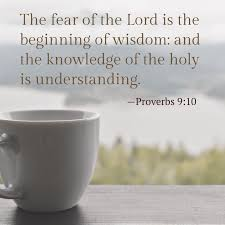

# Fifth Exploration: The Gateway Condition — The Fear of the Lord

## Why This Is Its Own Exploration
I could have included this as a subsection of the Fourth Exploration, but the more I sat with it, the more I realized the Fear of the Lord deserves its own treatment. It is not just a preamble to Wisdom — it is the starting condition for an entire epistemological orientation. It changes how I know things, not just what I know. That puts it in a different category from the other elements of the Wisdom cluster. It is the switch that either opens or closes the circuit.

## The Scriptural Ground
***Prov. 1:7 (ESV)***

*"The fear of the Lord is the beginning of knowledge; fools despise wisdom and instruction."*

***Prov. 9:10 (ESV)***

*"The fear of the Lord is the beginning of wisdom, and knowledge of the Holy One is understanding."*

***Isa. 11:2-3 (ESV)***

*"And the Spirit of the Lord shall rest upon him, the Spirit of wisdom and understanding, the Spirit of counsel and might, the Spirit of knowledge and the fear of the Lord. And his delight shall be in the fear of the Lord."*

***Ps. 111:10 (ESV)***

*"The fear of the Lord is the beginning of wisdom; all those who practice it have a good understanding."*

Four times in the wisdom literature, the same structure appears: Fear of the Lord is the beginning — the arche, the origin point, the first cause — of wisdom and knowledge. This is not a suggestion or a nice-to-have. It is stated as a foundational logical relationship. You do not gain genuine wisdom by working harder or studying more. You get it by starting in the right place.

## What Does "Fear of the Lord" Actually Mean?
This is where I want to be careful, because the English word fear flattens something that is much richer in the Hebrew (yir'ah). This is not the terror of an arbitrary tyrant. It is the awe, reverence, and deep attentiveness that come from encountering the holy. It is the response of a creature who has genuinely grasped who God is — not as an abstraction, but as the living reality who is both utterly transcendent and immediately present. Rom. 1:19-20 is relevant here. Creation speaks, all the time, of “His eternal nature and divine power.” That speaking should induce this kind of fear of an awesome creator God. We might ignore that speaking because it is so familiar, and it's just “natural”, right? This is a heart that has been hardened because it is familiar and no longer awe-inspiring to us. Hardness is encased in a presumptive attitude.

The practical effect of the Fear of the Lord is that it correctly orients me. It places me as a creature before the Creator. And that correct orientation is the starting condition for all genuine knowing. Without it, I make myself the center of the epistemic universe — I evaluate everything from my own vantage point, which means I start from a fundamentally distorted position. The Fear of the Lord fixes the reference point.

## The Electrical Engineering Analogy
I am an electrical engineer by training and practice, so let me reach for an analogy that has been helpful to me. In any electrical circuit, ground potential is the reference point from which all voltages are measured. Without a ground reference, the concept of a voltage difference floats — you can measure the difference between two points, but you have no fixed reference. The Fear of the Lord is the spiritual ground reference. It is the fixed point from which all other knowing can be accurately measured. Operating without it is like trying to design a circuit with a floating ground — everything drifts, nothing is stable, and the readings cannot be trusted.

## How This Connects to What I Have Already Built
In the Rom. 10:17 chain, I noted that genuine hearing requires a willingness to obey. I see that willingness to obey is itself downstream from the Fear of the Lord. If I have truly grasped who God is — if the awe is real — then willingness to obey is not the struggle it otherwise would be. The Fear of the Lord is upstream of the hearing quality in the faith-generation chain.

This also connects to the new Sixth Exploration on the Obedience Channel. The Fear of the Lord is what makes obedience the natural posture rather than a constant battle of wills.

**Proposed Law (Structural — Gateway): The Fear of the Lord is the logically prior condition for the operation of the Wisdom-Knowledge-Understanding-Discernment cluster. It functions as the epistemic ground reference — the fixed point from which all spiritual knowing can be accurately oriented. Without it, what appears as wisdom is merely cleverness operating from a distorted reference point.**

**Certainty: 85%  ***Among the highest-confidence laws in this volume. The scriptural repetition is explicit and consistent across multiple wisdom texts. The mechanism (correct orientation of the self) is coherent with both scripture and experience.*

**FORMATION DOCUMENT CONNECTION: ***The Fear of the Lord as the fixed point from which all spiritual knowing can be accurately oriented is the functional equivalent of what SST calls the spirit’s regeneration threshold: before Stage 1.1 (Regeneration), the person is not merely at a lower developmental stage — they have not yet entered the formation system at all. SST makes a parallel structural claim: a person who has not experienced regeneration has not yet entered the spirit taxonomy. The Fear of the Lord functions as the epistemic correlate of that ontological threshold — the moment at which the knowing faculty is correctly oriented toward its source. Note the asymmetry worth holding: the **IJH** frames this as a structural gateway law (it describes the architecture), while SST frames it as a developmental entry condition (it describes the first event in a sequence). Both framings are needed; neither is complete on its own.*

**Sixth Exploration — New Discovery**
