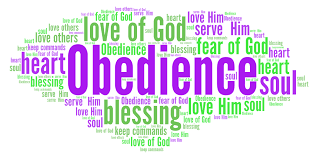

# Sixth Exploration: The Obedience Channel — How Revelation Flows

## The Discovery
This is one of those things that, once I saw it, I could not un-see it. And I am a little embarrassed that I had not formalized it as a law earlier, because it has operated in my life for decades. The law is simple: acting on what God has already shown you is the condition for receiving more revelation.

## The Scriptural Ground
***John 7:17 (ESV)***

*"If anyone's will is to do God's will, he will know whether the teaching is from God or whether I am speaking on my own authority."*

There it is. The condition is willing obedience. The result is knowing. And note the direction: it is not "know first, then obey." It is "be willing to obey, and then you will know." This inverts the way most people think about spiritual growth. We want understanding before commitment. God offers understanding as the fruit of commitment.

C.S. Lewis makes an argument in Mere Christianity that runs exactly parallel to this law and illuminates why it works. He notes that if you act as if you love your neighbor before you feel love, the feeling tends to follow the action — not because you have manipulated your emotions, but because you have aligned yourself with how reality is actually structured. Love is the grain or direction of the universe; acting with it puts you in contact with something real. I think the same principle operates in the Obedience Channel. When I obey before I understand, I am not merely submitting to an arbitrary divine test of loyalty. I am aligning myself with the epistemic structure of a universe in which willingness to obey is the perceptual condition for seeing clearly. Disobedience, conversely, does not merely fail to open the channel — it distorts the instrument of perception itself. This is why the author of Hebrews can speak of hearts being hardened through the deceitfulness of sin (Heb. 3:13): habitual disobedience does not just block revelation, it progressively corrupts the capacity to receive it. The obedience is not the price you pay for revelation; it is the restoration of the receiving instrument to working order.

***John 14:21 (ESV)***

*"Whoever has my commandments and keeps them, he it is who loves me. And he who loves me will be loved by my Father, and I will love him and manifest myself to him."*

The word manifest here is emphao — to show clearly, to make visible. Jesus is saying that the experience of His presence and self-revelation is conditioned on keeping His commandments. Obedience is the channel through which the revelation flows. This connects directly back to the Faith cluster: obedience deepens love, love deepens faith, and faith increases the quality of hearing.

***1 Sam. 15:22-23 (ESV)***

*"Has the Lord as great delight in burnt offerings and sacrifices, as in obeying the voice of the Lord? Behold, to obey is better than sacrifice, and to listen than the fat of rams. For rebellion is as the sin of divination, and presumption is as iniquity and idolatry."*

Samuel’s rebuke of Saul introduces the negative case with striking force. Disobedience is not merely a moral failure — it is rebellion that operates like divination and idolatry. In systems terms, disobedience not only fails to open the channel; it actively closes it and introduces noise that corrupts the signal.

## The Time Delay Factor
One aspect of this law that has been important in my own life is the time delay between obedience and the next revelation. God typically does not give the next instruction immediately after I obey the last one. There is a waiting period. This has several implications in a systems dynamics model: the delayed feedback makes it hard to see the causal connection, which is probably why so many people miss it. If the gap between obedience and the next revelation is weeks or months, and I am not paying attention, I may never connect them.

This is also related to what Jesus says about the virgins with oil in their lamps (Matt 25) — the readiness is maintained by ongoing attentiveness during the waiting period. The obedience that keeps the channel open includes the obedience of staying attentive during the delay.

## The Community Dimension
There is a collective version of this law as well. When a community is in collective disobedience — corporate hardness of heart — the revelation available to that community is suppressed. Deuteronomy 28 is the great national if-then chapter in the Old Testament: if the community walks in obedience, the outpouring of blessing and revelation follows; if not, the channel closes and the consequences compound. This is worth its own extended discussion, but I flag it here as an important extension of the personal law.

**Proposed Law (Operational): Obedience to prior revelation is the causal condition for receiving subsequent revelation. The quality of the hearing channel in the Word → Hearing → Faith chain is modulated by obedience history. Obedience keeps the channel open and increases its gain; disobedience introduces resistance and, compounded, closes the channel entirely. There is typically a time delay between obedience and next-revelation that makes the causal connection easy to miss.**

**Certainty: 85% ***High confidence. John 7:17 is explicit; the pattern is confirmed across multiple texts and in personal experience. The time delay mechanism and its systems dynamics implications are still being worked out.*

**VOL 3 CONNECTION: ***The Obedience Channel law is one of the two primary feedback loops in Vol 3’s systems dynamics model (Vol 3, Exp. 7: Feedback Loops). Vol 3 formalizes it as the Faith-Obedience Reinforcing Engine — the self-amplifying loop in which obedience generates confirmation, confirmation increases trust, and increased trust produces more obedient action. Vol 3 also quantifies the time-delay variable introduced here as a critical parameter in the loop’s behavior.*

**FORMATION DOCUMENT CONNECTION: ***The Obedience Channel — obedience to prior revelation as the causal condition for receiving subsequent revelation — is what HFT’s Affective Level 3 (Valuing) looks like from the outside. At Level 3, the person is pursuing scripture not because external structures require it but from personal desire and conviction; at Level 3 they also begin acting on what they hear, which is exactly the obedience this law names as the channel-opening event. MSFIG develops this further: the Willard-Friesen debate about quotidian guidance is resolved by the taxonomy precisely at this point — Willard’s practice of attending to the Spirit in small decisions is training for the Level 2 to Level 3 transition, building the obedience habit that eventually becomes characteristic. The time-delay variable flagged in this law’s Certainty statement — the gap between obedience and next revelation that makes the causal connection easy to miss — is directly relevant to MSFIG’s section on non-linear, spiral progress: what looks like stagnation during the delay period may be Brueggemann’s disorientation phase operating as a formation engine.*

**Seventh Exploration — New Discovery**
