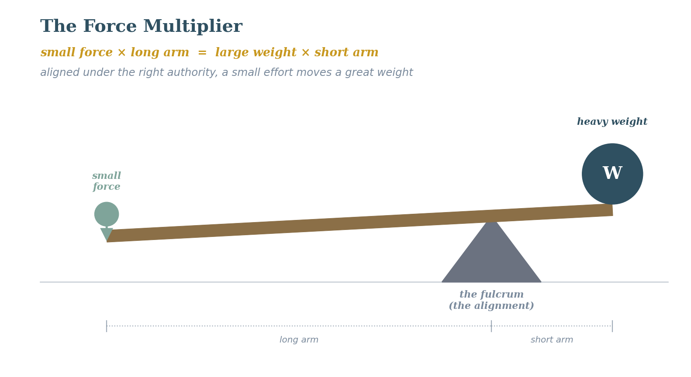

# Seventh Exploration: Spiritual Authority — The Force Multiplier

## The Discovery That Changes the Equations
Here is something I have had sitting in my notes for years without elevating it to the status of a law. It deserves that status. The discovery is that operating within properly delegated spiritual authority is not just the right thing to do — it amplifies the spiritual force available. Authority is a force multiplier in the spiritual dynamics.

## The Centurion: A Case Study in Authority-Based Faith
***Matt. 8:8-10 (ESV)***

*"But the centurion replied, 'Lord, I am not worthy to have you come under my roof, but only say the word, and my servant will be healed. For I too am a man under authority, with soldiers under me. And I say to one, 'Go,' and he goes, and to another, 'Come,' and he comes, and to my servant, 'Do this,' and he does it.' When Jesus heard this, he marveled and said to those who followed him, 'Truly, I tell you, with no one in Israel have I found such great faith.'"*

This is the only person in the gospels of whom Jesus says He marveled at his faith. And what is the centurion demonstrating? He is not showing emotional intensity or spiritual passion. He is showing structural understanding. He understands the authority architecture: he is a man under authority (the Roman chain of command), which is precisely why he can exercise authority over those under him. And he correctly perceives that Jesus operates the same way — under the authority of the Father, which is why His word carries power over sickness and creation.

The centurion’s faith is so remarkable to Jesus because he grasped something the disciples, who had been watching miracles up close, had not yet grasped: it is the authority structure that makes the command effective, not merely the desire or even the sincerity of the one asking.

## The Authority Hierarchy
***Matt. 28:18 (ESV)***

*"And Jesus came and said to them, 'All authority in heaven and on earth has been given to me.'"*

***Luke 10:19 (ESV)***

*"Behold, I have given you authority to tread on serpents and scorpions, and over all the power of the enemy, and nothing shall hurt you."*

***Eph. 1:20-22 (ESV)***

*"...when he raised him from the dead and seated him at his right hand in the heavenly places, far above all rule and authority and power and dominion, and above every name that is named, not only in this age but also in the one to come. And he put all things under his feet and gave him as head over all things to the church..."*

The structural picture here is: all authority is delegated from the Father to the Son. From the Son, authority is delegated to believers as His representatives, His church, His body. The effectiveness of a believer’s prayer and spiritual action is a function of operating within that delegation correctly.

The same impact is seen: when the father sins, the family suffers; when the king sins, the kingdom suffers. It is at a minimum a reason to pray for those in authority.

## The Negative Case: What Happens When Authority Is Misaligned
***Acts 19:13-16 (ESV)***

*"Then some of the itinerant Jewish exorcists undertook to invoke the name of the Lord Jesus over those who had evil spirits, saying, 'I adjure you by the Jesus whom Paul proclaims.' Seven sons of a man named Sceva, a Jewish chief priest, were doing this. But the evil spirit answered them, 'Jesus I know, and Paul I recognize, but who are you?' And the man in whom was the evil spirit leaped on them, mastered all of them and overpowered them, so that they fled out of that house naked and wounded."*

I find this passage both sobering and deeply clarifying. The sons of Sceva used the right name, the right formula — and got beaten up. Why? Because they had no authority relationship with Jesus. They were using His name as a formula rather than operating within a delegated authority structure. The evil spirits recognized the difference. This is the clearest negative proof case I know of for the authority law.

Wayne Grudem’s treatment of church authority and eldership adds a dimension I want to flag here: the Sceva problem in contemporary church life is less often outright occultism and more often what I would call unaccountable authority — believers who believe they are operating within a legitimate spiritual delegation but who have no community structure to test, affirm, or correct that claim. The centurion’s authority was not self-declared; it was conferred, documented, and accountable upward in a chain of command he had not invented. The practical implication for the Laws of the Spirit project is that claims to operate in significant spiritual authority — intercession, healing, prophetic ministry — should be exercised within an accountable community structure rather than as solo exercises. The training plan in Vol 2 should be understood as providing part of that structure.

## What This Means for the Spiritual Dynamics
In terms of the spiritual force discussion I am developing, if faith is the raw spiritual force, then authority is the transmission structure that directs and amplifies that force. Operating outside of proper authority is like trying to run current through a broken circuit — the force may be present, but it does not complete the path to produce useful work. Operating within proper authority is like putting that same force through a working circuit with the right transformer — it arrives at its destination with the full voltage intact, potentially amplified.

This also means that humility — genuine structural humility, not performed modesty — is not merely virtuous. It is operationally necessary. It is what keeps me positioned correctly within the authority structure so that the force multiplier is actually working.

**Proposed Law (Operational): Spiritual authority is delegated hierarchically from the Father through the Son to believers. Operating within properly delegated authority amplifies the effective spiritual force available — functioning as a force multiplier in ****the spiritual calculus. Operating outside of delegated authority disconnects the circuit and can produce dangerous results.**

**Certainty: 80%  ***The centurion passage is unambiguous; the Acts 19 negative case is stark. The precise mechanics of "operating within authority" in everyday spiritual life are still being worked out — this is an open trail.*

**Eighth Exploration — New Discovery**
