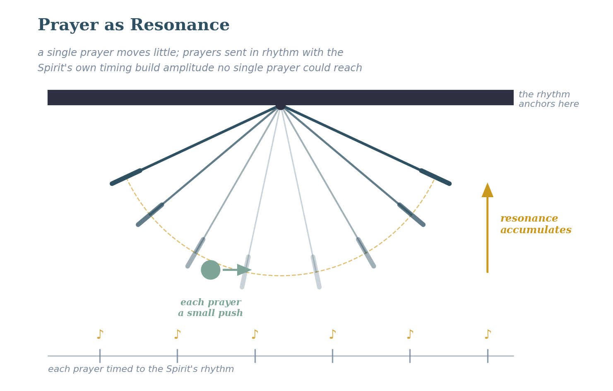

# Eighth Exploration: Prayer as a Resonance Phenomenon

## The Starting Intuition
I note in the Spiritual Dynamics section (Vol 3) the analogy of a pendulum: a small force applied at the right place and at the right frequency will produce an increasingly large response. I described repetitive prayer as a possible analog to this, applied at the right "point" with the right "frequency" and "force" to give outsized results. I want to develop this carefully here, because I think there is a genuine law operating beneath the persistence-in-prayer passages of scripture.

## The Scriptural Ground
***Luke 18:1 (ESV)***

*"And he told them a parable to the effect that they ought always to pray and not lose heart."*

The parable of the persistent widow is not simply a story about stubbornness. Jesus explicitly gives the purpose at the outset: they ought always to pray and not lose heart. There is something about persistence, applied prayer maintained over time, that is structurally necessary, not just morally admirable.

***Jas. 5:16 (ESV)***

*"Therefore, confess your sins to one another and pray for one another, that you may be healed. The prayer of a righteous person has great power as it is working."*

The phrase "as it is working" is the key. The Greek is energoumene — from the same root as energy, being energized, in operation. This is not a static state. It is an ongoing dynamic process. Prayer is not a single pulse that either hits or misses. It is spiritual energy that can be understood as a directed waveform, maintained and active over time.

***Matt. 17:20-21 (ESV)***

*"He said to them, 'Because of your little faith. For truly, I say to you, if you have faith like a grain of mustard seed, you will say to this mountain, 'Move from here to there,' and it will move, and nothing will be impossible for you.'"*

## A Critical Clarification on the Mustard Seed
I need to pause here and be more precise than I have been in earlier drafts about what Jesus is saying with the mustard seed. There are two completely different physical models I could build from this passage, and they yield very different equations.

Model A: The mustard seed is a statement about a threshold. It is saying that even the smallest possible genuine faith — a quantity approaching zero — is sufficient. Faith does not need to be large; it needs to be real and be placed in the right soil. This is a step function: if genuine faith is present (above zero), it is sufficient. If it is absent, nothing works.

Model B: The mustard seed is a statement about proportionality. It is saying that faith-quantity and spiritual force output are proportional — a little faith moves a small mountain, a lot of faith moves a big mountain. This is a linear or power-law model.

These two models are not equivalent, and I have been loosely conflating them. My current reading of Matt. 17:20 is that it is primarily a threshold statement (Model A) — consistent with the disciples’ failure being attributed to "little faith," meaning absent or barely present faith, rather than to insufficient quantity. Also, there may be a combined statement where there are situations of threshold faith and situations of quantity faith. But this is something the community needs to weigh in on, because it significantly changes the downstream equations in the calculus.

## Prayer as a Resonance Structure
With that clarification in place, I believe prayer operates like a resonance phenomenon in a physical system. In physics, resonance occurs when an applied force matches the natural frequency of the system being driven. Think of getting a swing moving at resonance: a small, ongoing force produces a large response. The key variables are: the right frequency (alignment with God’s will and timing), the right direction (not just any request but one aligned with what God is doing), and the right persistence (maintained over time, not a single pulse) with the right frequency of “push” (to sync up with what God is doing).

This is why Jesus teaches both "ask, and it will be given" (Matt. 7:7 — the threshold principle) and the persistent widow (Luke 18 — the resonance principle). They are not contradictory; they describe different aspects of the same system. Some things are released immediately upon a genuine, faith-filled request. Other things require persistent, aligned, energized prayer maintained over time until the resonance builds.

My early experience with persistence drove this principle home in a very personal way. Carolyn and I went through the “Life in the Spirit” seminar at Truro Church in the mid-80s, and at the end, prayer was offered for anyone who wanted to receive a prayer language. Picture a large sanctuary, with people scattered around, maybe 50 or so, paired up with a person praying for them to receive. All sorts of people were receiving, and when my turn came, all I got was a single syllable with a simple tune. Talk about disappointment. Well, I took that single syllable, and recognizing Matthew 25:29, “For to everyone who has will more be given, and he will have an abundance.” I started using that single syllable when driving to and from work daily. A few months later, I was in a large workshop where the leader had us stand up and turn to pray for the person beside us. As I did that, a full language came forth. I certainly did not know what to pray for this person, but the Holy Spirit did. I understood that I had been given a tool to use, as He directed, also that I was to be faithful in the little I had been given. Big impact.

The Elijah passage is another example of the resonance structure in action. He prayed for rain seven times before the cloud appeared (1 Kgs. 18:41-45). This was not a lack of faith in the first prayer — it was an aligned, persistent prayer maintained until the response came. The seven-fold repetition was the waveform being sustained until resonance was built.

I want to flag an interesting dimension of the resonance model: the receiving direction. Richard Foster notes in “Prayer: Finding the Heart’s True Home” that most of us have only learned to pray in one direction, toward God, with requests. But a resonance structure receives as well as emits: the tuning fork that vibrates at 440Hz also detects 440Hz from across the room. The contemplative tradition — Foster, John of the Cross, Ignatius describes a mode of prayer that is more receptive than petitionary, more attentive than urgent. In the language of this exploration, it is less about building resonance toward a breakthrough and more about learning to detect what is already resonating at God’s frequency and aligning with it. Both modes are prayer; they are not in competition. But a training plan that develops only the petitionary mode leaves the receiving capacity underdeveloped, which is itself a kind of hearing limitation.

**Proposed Law (Operational): Prayer produces maximum spiritual force when three conditions align — direction (in harmony with God's will and character), timing (discerned spiritual readiness in the situation), and persistence (maintained over time as a waveform rather than a single pulse). When these align, even a small measure of genuine faith can produce results disproportionate to the natural forces involved — the resonance principle. The threshold condition (Model A from Matt. 17:20) establishes the minimum entry requirement; the resonance structure describes what happens above the threshold.**

**Certainty: 70%  ***The resonance analogy is compelling and consistent with multiple scripture patterns. The mustard seed model question (threshold vs. proportionality) is genuinely unresolved and materially affects the downstream equations. This one needs the most community testing of any exploration in this volume.*

**VOL 3 CONNECTION: ***The resonance model of prayer introduced here is the direct precursor to Vol 3’s threshold-event theory of miracles (Vol 3, Exp. 8). Vol 3 formalizes the three conditions (direction, timing, persistence) as three of the four multiplicative factors in the spiritual force equation: F_s = f(trust) x g(authority) x h(resonance) x **i**(channel clarity). The resonance term h() encodes everything developed in this exploration.*

**FORMATION DOCUMENT CONNECTION: ***The three conditions for maximum spiritual force in prayer (direction, timing, persistence, and frequency) map onto formation stages in ways the MSFIG paper helps clarify. Direction — prayer in harmony with God’s will and character — corresponds to Affective Level 4 (Organization): a person whose entire value system is being integrated around scripture is developing the capacity to pray in alignment with what they are learning God values. Timing — discerned spiritual readiness — corresponds to the spirit taxonomy’s Stage 2 (Learning to Follow the Spirit), where discernment of the Spirit’s promptings is explicitly the developmental task. Persistence — maintained as a waveform rather than a single pulse — is addressed directly in SST’s spirit Stage 3.2 (Intercession and Prayer Depth), where prayer deepens from petition-dominant to Spirit-driven intercession aligned with God’s own purposes. The formation implication: prayer at the resonance level described in this law is not a beginner practice but requires development across multiple dimensions simultaneously.*
