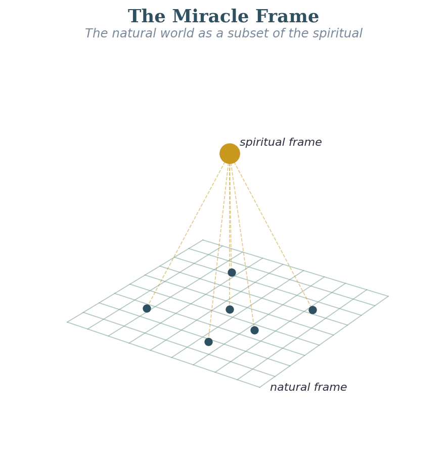

# Opening Exploration: The Miracle Frame — The Natural World as a Subset

## Why This Has to Come First
I originally had this discussion buried in the Framework section near the middle of this document. As I reviewed the structure of Vol 1, I realized that it was a mistake. This is the load-bearing premise of the entire investigation. If I can’t establish it, everything else I am doing is just interesting theology. If I can establish it, even at 70% certainty, then the rest of this work is not just interesting, it is urgent.

The premise is this: miracles are not violations of natural law. They are instances of a higher-order law operating on the natural world from a dimension that contains the natural world as a special case. The urgency is, if we can see into these spiritual laws, even in part, we should be able to start to operate better in following Jesus, and miracles will become more ordinary, as Jesus demonstrated and invites us into. As he said, if we love him, we will obey his commands. This is about becoming soil (hearts) that hears and obeys, quickly and quietly.

## The Physics Analogy
Here is the analogy from physics that I find most compelling. For two hundred years, Newtonian mechanics was the complete description of physical reality. Then Einstein showed that Newtonian mechanics is actually a special case — it gives the right answers at low velocities and in weak gravitational fields, but it is a subset of a more general framework. From inside the Newtonian frame, relativistic effects look impossible, or at least anomalous. From inside the Einsteinian frame, they are perfectly lawful.

C.S. Lewis arrives at the same superset conclusion from a philosophical direction worth noting. In Miracles, he argues that naturalism — the claim that the physical universe is all there is — is self-defeating, because the very act of reasoning our way to that conclusion requires us to trust our minds as truth-tracking instruments. But if our minds are nothing but physical processes, there is no reason to trust them any more than we trust a calculator that has been dropped. Reason, Lewis argues, must be something that enters the natural order from outside it, which is precisely the subset relationship I am describing from scripture. I find it significant that the physicist’s analogy, the philosopher’s argument, and the apostle’s statement in Heb. 11:3 all converge on the same structural claim: the natural world is derived from and upheld by something larger than itself.

I believe miracles work the same way. The natural world is a projection of a more general spiritual reality. When Jesus walks on water, He is not breaking the law of gravity. He is operating from a dimension in which gravity is a special case of a more general field equation. The miracle is not anomalous from the larger frame; it only appears anomalous from within the natural frame.

## The Scriptural Ground
***Heb. 11:3 (ESV)***

*"By faith we understand that the universe was formed at God's command, so that what is seen was not made out of what is visible."*

This is a remarkable statement. It says the visible world was constructed from the invisible one. The natural is not self-contained; it is derived from the spiritual. The spiritual is not a separate domain that occasionally intersects the natural. The natural is a subset of the spiritual, the way a two-dimensional cross-section is a subset of the three-dimensional object it cuts through.

***Col. 1:15-17 (ESV)***

*"He is the image of the invisible God, the firstborn of all creation. For by him all things were created, in heaven and on earth, visible and invisible, whether thrones or dominions or rulers or authorities — all things were created through him and for him. And he is before all things, and in him all things hold together."*

Paul is saying that the structural coherence of the natural world, the fact that it holds together at all, is a function of Christ’s ongoing sustaining activity. The natural world is not self-sustaining. It is upheld by a spiritual reality. That is exactly the subset relationship I am describing.

***2 Kgs. 6:15-17 (ESV)***

*"When the servant of the man of God rose early in the morning and went out, behold, an army with horses and chariots was all around the city. And the servant said, 'Alas, my master! What shall we do?' He said, 'Do not be afraid, for those who are with us are more than those who are with them.' Then Elisha prayed and said, 'O Lord, please open his eyes that he may see.' So the Lord opened the eyes of the young man, and he saw, and behold, the mountain was full of horses and chariots of fire all around Elisha."*

This is the clearest illustration I know of the larger frame being literally revealed. The spiritual army was already there. The servant couldn’t see it. Elisha could. The miracle was not the army’s arrival; it was the opening of the young man’s eyes to what was already present. This is what I mean when I say the natural world is a subset. The larger reality is already here. Most of us just can’t see it yet.

May the Lord open our eyes and show us what is actually before us, if we are ready to see.

## What This Means for How Miracles Work
If the natural world is a subset of the spiritual, then miracles are events in which the laws of the larger frame override the laws of the special-case frame. This is important because it means miracles are lawful; they follow the higher-order laws of the spiritual world, even when they appear to violate the lower-order laws of the natural world. Matthew 18 on binding and loosing are real actions that cause real effects.

This reframing has a practical implication that I find deeply exciting: if miracles are lawful, they are not random. They are the predictable result of operating in alignment with the higher-order laws. Jesus didn’t end his prayers with "well, we’ll have to wait and see, because you just never know what God’s going to do." He knew what God was doing. The rest of this volume is an attempt to understand more of what those higher-order laws look like.

**Proposed Law: The natural world is a proper subset of God's larger spiritual reality, his kingdom. Miracles are not violations of natural law — they are instances of a higher-order law operating on the natural world from a superset of dimensions. The closer a person operates in alignment with the higher-order laws, the more "miraculous" results will appear from within the natural frame.**

**Certainty: 75%  ***The conceptual framework is strong and scripturally grounded. The precise form of the higher-order laws and their specific mathematical structure is the open trail ahead of us.*

**FORMATION DOCUMENT CONNECTION: ***The miracle frame established here, that the natural world is a subset of a larger spiritual reality, is the metaphysical presupposition of the entire formation project. The MSFIG paper’s claim that the Holy Spirit is the irreducible primary agent of formation, with the Affective Taxonomy describing only the human side, assumes exactly this ontological layering: the Spirit works from within a larger frame that the natural self cannot generate or control. SST’s spirit taxonomy begins at the same presupposition: regeneration is not a human developmental achievement but the Spirit’s sovereign act, making the human spirit alive to a reality it was previously unable to perceive. The open question this surfaces: can the **IJH** quantitative program (Vol 3) eventually say something precise about the bandwidth difference between a person at Spirit Stage 1 and Stage 5?*
