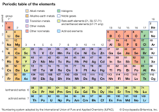

# Spiritual Force, Energy, and Power

## The Developing Dynamics
My goal in this section is to begin developing the quantitative language for the spiritual laws I have identified — to move from "there is a relationship" to "here is how to describe the relationship with more precision." This is visionary work. This brief discussion is a starter and a connector for the more complete discussion in Vol 3.

### Force, Work, and Trust
My working definitions: Spiritual force is the capacity to produce spiritual work — to move things in the spiritual domain, which then manifests in the natural. Trust (faith, pistis) is the primary stock that determines how much spiritual force is available. The more genuine trust I have — not intellectual assent but operational trust, the kind that changes actions — the more force is available.

The mustard seed passages establish the threshold condition: a small amount of genuine trust is sufficient to produce results that appear impossible from the natural frame. But I want to be precise about this — I think the mustard seed is at least a threshold statement (is the trust genuine, above zero?) rather than a proportionality statement (is there enough trust?), but a mixed model is open for investigation. This matters for the equations.

### The Trust-as-Stock Model
In systems dynamics language, trust is a stock — it accumulates over time, it can be depleted, and it can be replenished. The inflow to the trust stock is hearing the Word (about Christ) with willingness to obey (Exploration 1 chain). The outflow from the trust stock includes acting on faith (which can either replenish the stock if the action confirms the truth or deplete it if I am operating presumptuously) and the corrosive effect of environments and voices that introduce unbelief.

The feedback loop is: more trust → more action in faith → more confirmation → more trust. The negative version: less trust → less action → less confirmation → less trust. The reinforcing loop runs in both directions. This is consistent with Jesus’ statement that "to the one who has, more will be given; and from the one who has not, even what he has will be taken away" (Matt. 13:12 ESV). That is a description of a reinforcing feedback loop.

### The Resonance Connection
From the Eighth Exploration: prayer operates as a waveform. The frequency, direction, and persistence of the waveform determine whether resonance builds. From the Authority Exploration: authority structure is a force multiplier — it is the transmission architecture that directs the force where it needs to go. These two factors operate on top of the base force available from the trust stock.

A provisional equation structure (at very low confidence, offered as a working hypothesis for the community to test): Effective spiritual force = f(trust stock) × g(authority alignment) × h(prayer resonance). Where f, g, and h are functions I cannot yet specify, and where h operates over time rather than at a single point. This is the beginning of the calculus, not the end. I am holding this at about 40% certainty on the specific structure, 70% on the general idea that these factors interact multiplicatively rather than additively.

## Open Questions
The most important open questions in the spiritual calculus at this point:

- What are the conservation laws? If spiritual energy can be applied to do spiritual work, is there a principle of conservation that governs how it transforms?
- What are the field equations? Maxwell unified electricity and magnetism into a set of field equations that predict the behavior of electromagnetic fields everywhere in space. Is there a spiritual analog — a set of equations describing the "field" of the Spirit that predicts how spiritual force distributes and propagates?
- What is the role of time and space? The Obedience Channel law introduces time delay as a critical variable. Does distance matter in prayer? Is spiritual time different from our experience? Sounds like a rhetorical question when posed. The centurion’s servant was healed at a distance. What are the spatial boundary conditions, if any?
- How does the collective stack up? The community dimension of all these laws is largely unexplored. How does the trust stock of a congregation sum? Is it simply additive, or is there a threshold effect where collective trust above a certain level produces disproportionate results?
Please see Vol 3 for the extensions of these questions.

## Speculative Laws for consideration and further development
These have not been investigated in any depth and really are just notes for future work.  I actually always have such a set of notes. I have more ideas than solutions, one of the exciting things about this work. I expect the Lord will call me home before it's all done. I also hope my kids, grandkids, and maybe others will find it interesting and take it further.

**The Attention Economy of the Soul**

Scripture repeatedly treats *what you fix your attention on* as causally determinative of what you become. "Whatever is true, whatever is honorable... think about these things" (Phil. 4:8) is not merely advice — it has the structure of a law. "We all, with unveiled face, *beholding* the glory of the Lord, are being transformed into the same image" (2 Cor. 3:18) makes the transformation a direct function of sustained attention. The possible law: *the soul moves toward its sustained object of attention, and is progressively conformed to it.* This would apply symmetrically in both directions — toward God and toward anything else. It would connect to the idolatry warnings in a new way: idolatry isn’t just a moral failure, it’s an attentional mechanism that is working exactly as designed, but aimed at the wrong object. Secular research actually agrees. There are physical changes that are measurable as you train your brain. Note that 2 Cor. 3:18 (ESV) — “And we all, with unveiled face, beholding the glory of the Lord, are being transformed into the same image from one degree of glory to another” — makes the transformation a direct function of sustained attention, which is the same mechanism this law proposes; the connection to that passage is made more fully in the Vol 3 Glory Attractor exploration. Confidence: maybe 70%, but the specific mechanism and time constant are completely open.

**The Gratitude Amplifier**

There is a pattern across Paul's letters that is easy to miss because gratitude looks like a response rather than a cause. But Rom. 1:21 frames ingratitude as the *first* step in the downward spiral — "although they knew God, they did not honor him as God or give thanks to him, and they became futile in their thinking." The direction of causation is striking: ingratitude precedes futile thinking, which precedes darkened hearts, which precedes the rest. Running it forward: gratitude may function as a channel-opener in the same structural way obedience does. 1 Thess. 5:18 ("give thanks in all circumstances, for this is the will of God") and the Psalms' constant movement from lament to praise suggest that gratitude is not merely an emotional response to blessing but an *active spiritual practice* that maintains the hearing channel. Possible law: *sustained gratitude keeps the perception channels open; sustained ingratitude progressively closes them, independent of circumstances.* This would give a specific mechanism for why Brueggemann's disorientation phase is formative when navigated with thanksgiving and destructive when navigated with bitterness. Confidence: 65%.

**The Confession-Clarity Law**

Jas. 5:16 says, "Confess your sins to one another, and you will be healed" —the community dimension is explicit, and most treatments domesticate it into private confession to God. But the deeper pattern may be this: unspoken sin creates a specific kind of interior opacity. Not just the channel-blockage of unconfessed sin before God (the Ps. 66:18 pattern), but a loss of *self-clarity* — the person who is hiding something from the community gradually loses the ability to see themselves accurately. The possible law: *what is named and brought into light becomes available for transformation; what is kept in **darkness degrades the entire interior navigation system, including the ability to perceive what is in darkness.* John 3:20-21 has exactly this structure. The practical implication would be that spiritual direction and accountability relationships are not merely useful but structurally necessary for sustained formation past a certain point. Confidence: 70%, but the specific mechanism of how hiddenness degrades self-perception is underdeveloped.

**The Forgiveness-Debt Transfer Law**

Matthew 18 (the unforgiving servant) has a structural claim embedded in it that is starker than it is usually read: the servant who refuses to forgive has his own forgiven debt reinstated. Jesus is not saying "it would be nice if you forgave." He is describing a mechanism. The possible law: *unforgiveness reinstates the spiritual debt structure that forgiveness had dissolved — not as punishment imposed from outside but as the natural consequence of refusing to participate in the economy that produced one's own release.* This would connect to the emotional knot work in Vol 2: many of the deepest knots have an unforgiveness component, and the reason they resist clearing may be that the debt structure is actively maintained by the refusal to release. The law would also predict a specific feedback loop: unforgiveness → debt reinstated → increased self-condemnation → increased difficulty forgiving others → deeper knot. Confidence: 75% on the structural claim; lower on the specific mechanism.

**The Worship Alignment Law**

This is the most speculative entry here, and possibly the most interesting. The Psalms treat worship not just as a response to God but as a *reality-calibration mechanism* — when the psalmist moves from lament to praise within a single psalm without the circumstances changing, something in their perception of the circumstances has been realigned, not the circumstances themselves. The possible law: *worship that is genuinely directed at God (rather than performed for self or others) functions as a recalibration of the soul's perception of what is real and what is primary — it resets the baseline from which all subsequent judgment and decision proceeds.* This would give a structural account of why Isaiah 6 (worship leading to commissioning) and Revelation 4-5 (cosmic worship as the frame for all subsequent action) and the Psalms' move from disorientation to orientation are all describing the same underlying mechanism. It would also explain why worship that stays at Affective Level 2 (performative attendance) does nothing for perception: the recalibration only occurs when the attention is genuinely directed outward toward God rather than inward toward one's own spiritual state. Confidence: 55%, with the specific mechanism almost entirely open.

**The Prophetic Imagination Law**

This one comes from the Prophets and is almost entirely uncharted in the current framework. The prophets don't just predict the future — they *hold open* an alternative reality in front of a community that has been captured by the imagination of the present empire (Brueggemann's language, but the scriptural ground is solid). The possible law: *the capacity to act in faith is bounded by the capacity to perceive an alternative to the present visible reality — and that capacity for alternative perception is directly trainable through sustained engagement with scripture's narrative, especially the prophetic and **eschatological literature.* This would connect to the Vol 3 eschatological law: the Glory attractor only functions as an attractor if it is actually held in view, and holding it in view against the weight of present circumstance is a specific and trainable skill. The implication for formation: prophetic literature may serve a different function than instructional literature — not teaching principles but *expanding the imagination's range*, which is a precondition for faith action at scale. Confidence: 60% on the structural claim; the mechanism is entirely open.

**The Generational Transmission Law**

This is perhaps the most unsettling possible law in the list. The Old Testament is explicit that certain things — blessings and curses both — transmit across generations in ways that go beyond genetics and culture (Exod. 20:5-6, Deuteronomy 28-30, and the entire Deuteronomic narrative). The New Testament doesn't repudiate this; it reframes it: Christ breaks the curse transmission (Gal. 3:13) and the blessing transmission is through faith (Romans 4). The possible law: *spiritual formation and spiritual damage both have transmission mechanisms that operate across generations, and the clearing work for an individual may require addressing not only their own knots but the generational patterns that created the conditions for those knots to form.* This would give a structural account of why some inner healing work is faster than others, why certain sin patterns recur with unusual persistence, and why the blessing language in the Abrahamic covenant is taken seriously across the New Testament as something that belongs to believers now. Confidence: 65% on the structural claim; the mechanism is deeply contested and the practice implications are theologically charged enough to require significant caution.

A few observations about this list as a whole. Most of these laws share a structural feature: they describe *mechanisms* that are already widely assumed in Christian practice but rarely articulated as laws with causal arrows and feedback loops. The attention economy, the gratitude amplifier, the forgiveness-debt transfer — these are taught as virtues or commands, but the IJH project is asking whether they are better understood as descriptions of how the system actually works, independent of whether anyone obeys them. That reframing changes what it means to "apply" them: you aren't just obeying a command, you are either working with or against a mechanism that operates whether you understand it or not. The parallel would be “obeying” gravity or not has real consequences, irrespective of your intent.

That's where the low confidence is most important. These are proposed mechanisms, not confirmed ones. The community testing the project calls for — which the Formation Documents make more specific and the Governance Model (Vol 6) implements as an open-source model — is precisely what these need before they can be elevated.

**A Periodic Table of Spiritual Laws — Working Draft**

*All 26 Confirmed Laws · 9 Speculative Extensions · 6 Open Unknowns*
