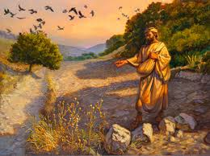

# First Exploration: The Heart Soil — A Diagnostic Map

## Why the Sower Parable Is Not Just About Evangelism
Most of the time when we read the parable of the Sower, we read it as a description of four kinds of people — the hardened unbeliever, the enthusiastic but shallow convert, the distracted churchgoer, and the genuine disciple. That reading is not wrong. But it is incomplete, and the incompleteness costs us something important.

The more searching reading is this: the four soil types describe four conditions of my own heart at any given moment — not four categories of people, but four regions of a person’s interior landscape. Parts of my heart are good soil. Parts are thorny. Parts are rocky. And parts — if I am honest — are still the hard path. The question is not which type am I, but rather: what is the current condition of each part of my heart, and which parts are blocking the fruit that God’s Word should be producing?

***Mark 4:14-20 (ESV)***

*"The **sower** sows the word. And these are the ones along the path, where the word is sown: when they hear, Satan immediately comes and takes away the word that is sown in them. And these are the ones **sown** on rocky ground: the ones who, when they hear the word, immediately receive it with joy. And they have no root in **themselves, but** endure for a while; then, when tribulation or persecution arises on account of the word, immediately they fall away. And others are the ones **sown** among thorns. They are those who hear the word, but the cares of the world and the deceitfulness of riches and the desires for other things enter in and choke the word, and it proves unfruitful. But those that were sown on the good soil are the ones who hear the word and accept it and bear fruit, **thirtyfold** and **sixtyfold** and a **hundredfold**."*

Notice what Jesus is saying about each soil type in terms of the Volume 1 hearing chain. The hard path: the word lands but is immediately taken. The channel closes before anything takes root. The rocky soil: the word enters, faith begins to form, and then tribulation applies pressure that the shallow root system cannot support. The thorny soil: the word enters, something begins to grow, but the energy of the thorns — cares, deceitfulness of riches, desires for other things — chokes it before it can produce fruit. Only the good soil completes the full chain: word in, genuine hearing, acceptance, fruit.

The thorny soil is the most important category for Vol 2’s purposes. The thorns are not sin in the simple sense — they are competing energetic loads. The word got in. Something is growing. But the thorns are consuming the available energy and attention, and the result is no fruit. This is exactly the condition I am calling an emotional knot, and it is the subject of the next exploration.

## The Diagnostic Questions
The practical use of the Sower parable as a diagnostic tool is to ask, honestly, about specific areas of my life:

- Where is the Word lands but immediately gets stolen before it takes root? What is the surface condition of that part of my heart — what has hardened it?
- Where is something growing but without the depth to survive pressure? What would it take to get roots down deeper in that area, to remove the rocks?
- Where is something growing but being choked by competing energetic loads — worry, distraction, unresolved grief, accumulated resentment? What are the thorn bushes in that particular region?
- Where is the Word actually producing fruit? What conditions in that part of my life created the good soil? Can those conditions be replicated elsewhere? Can good soil replace other types of soil?
These are not rhetorical questions. They are the starting point for the diagnostic work of Part I. I am asking you to do what I have had to do: sit with the parable and let it be a mirror, not a window.

**Proposed Law (Diagnostic): The four soil types in the parable of the ****Sower**** describe four conditions of the human heart, not ****just ****four categories of people. Most hearts contain all four conditions simultaneously in different regions. The diagnostic work of Vol 2 is to identify the specific soil condition in specific areas of my interior life — and to match the right clearing tool to the right soil problem.**

## The Three Levels of Good Soil: Not Just a Floor
One feature of the parable is particularly interesting: the good soil produces three different harvest levels. Thirty-fold. Sixty-fold. One hundred-fold. Jesus does not explain what distinguishes them, but the research on the Affective Taxonomy — which describes how values are progressively internalized through five identifiable stages — offers a formal framework for understanding this.

The four soil types map to the first four levels of the taxonomy in a way that is too precise to be coincidental. The hard path corresponds to pre-Level 1 (maybe call it Level 0): the word lands, but there is no real engagement, and the Enemy takes it immediately. The rocky soil corresponds to Level 1 (Responding): genuine engagement begins, with visible enthusiasm, but the motivation is still largely external — social, circumstantial — and the roots do not go deep enough to survive pressure. The thorny soil sits somewhere at Level 2: something is growing, but competing energetic loads (the cares of the world, the deceitfulness of riches) choke the development before it reaches the internalized-valuing threshold of Level 3+.

The three levels of good soil map to Levelss 3, 4, and 5 of the taxonomy: (3) Valuing — pursuing the Word intrinsically, not because anyone is watching; (4) Organization — the Word integrated into a coherent value system that informs every domain of life; (5) Characterization — the Word so thoroughly internalized that it has become a defining characteristic of who the person is, not just what they do. The 100-fold harvest is a person at Level 5: not deliberating about whether to obey, because hearing and obeying have become who they are.

This mapping has a direct practical implication for the diagnostic work of Vol 2. The question is not just “what type of soil am I?” but “what level of good-soil internalization am I at in this specific area, and what does movement to the next level require?” The answer to that second question differs for Levels 3, 4, and 5 from that for Levels 1 and 2. The tools in Explorations 2 through 6 primarily focus on clearing the obstacles that prevent Level 1 and Level 2 soil from becoming Level 3+. The practices in Parts II and III concern what sustains and deepens the journey from Level 3 through Level 5.

**Certainty: 90****%  ***High** confidence. Jesus’ own interpretation of the parable in Mark 4:14-20 supports the soil-as-heart-condition reading. The Affective Taxonomy mapping is new but internally consistent and supported by my research. The multi-region interpretation of a single heart is an inference, but one supported by Jer. 17:9 and the general witness of anyone who has tried to live the spiritual life with honest self-observation.*

**VOL 1 CONNECTION: The diagnostic framework here directly aligns with the Vol 1 hearing chain (Word ****→**** Hearing ****→**** Faith, Vol 1 Exp. 1) and the nested person structure (Vol 1 Exp. 2). The hard-path soil depicts the channel being closed before the Word can take root in the spirit. The rocky soil indicates faith being generated, but the heart lacks enough depth to sustain it. The thorny soil is the most operationally significant: it shows faith being created, but competing energetic loads prevent it from reaching the stage of obedient action that would confirm and deepen it.**

**FORMATION DOCUMENT CONNECTION: The four soil types, representing four conditions of the same heart, directly align with the level structure of the Affective Taxonomy in HFT and MSFIG. Hard-path soil (word ****sown**** but not received) corresponds to Affective Level 1 or below — the person is not yet attending. Rocky soil (initial response, shallow roots) aligns with ****Level**** ****1**** — genuine response but extrinsically motivated, lacking the depth for sustained obedience. Thorny soil (real growth****; distractions compete****) relates to ****Level**** 2****.**** The transition**** to ****Level**** 3 — the most critical and challenging threshold in the entire taxonomy, where competing values test emerging intrinsic motivation. Good soil (30-, 60-, 100-fold) matches ****Level****s**** 3, 4, and 5, respectively. This connection is intentional: the MSFIG paper explicitly states that the Parable of the Sower is the primary scriptural test of the Affective Taxonomy, and Jesus’ interpretive key in Mark 4:13 emphasizes that ****this parable is essential for ****hearing and obeying ****any parable. That makes this ****the meta-discipline of all formation ****and therefore essential.**

**Vol 2 — Exploration 2 — Operational Law**
