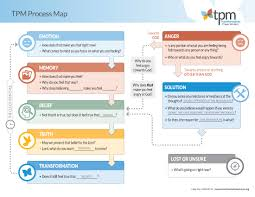

# Third Exploration: Believing a Lie — The Cognitive Blockage Law

## The Root Beneath the Root
Every emotional knot has a cognitive root — a belief about God, about myself, or about others that is false but that I have accepted as true, usually as a result of a wound or a repeated experience in which the lie was confirmed. TPM — Transformation Prayer Ministry — is built on this specific insight, and in my observation, it is correct: the Holy Spirit does not merely soothe the pain of a wound. He replaces the lie at the root of the wound with His truth. The soothing is the consequence of the replacement, not the mechanism.

This distinction is important because it explains why some inner healing work lasts and some doesn’t. If the prayer gets to the lie and the Spirit speaks truth into that specific place, the knot releases and stays released. If the prayer produces emotional relief without reaching the lie, the relief is real but temporary — the lie is still running underneath, and the knot will re-form.

## Where the Lies Come From
The most persistent lies are not ones I consciously adopted. They were installed by events — usually events in which I was young and had no interpretive framework, so I accepted the worst possible interpretation of what happened. A father’s absence becomes "I am not worth staying for." A mother’s rage becomes "I am the cause of bad things." An early failure becomes "I am fundamentally inadequate." A betrayal becomes "I cannot trust anyone." These are not conclusions I reasoned my way to; they are conclusions I absorbed because they were the only frame available in the moment.

***John 8:44 (ESV)***

*"...He was a murderer from the beginning, and does not **stand in** the truth, because there is no truth in him. When he lies, he speaks out of his own character, for he is a liar and the father of lies."*

The adversary’s primary weapon is not temptation to gross sin; it is the installation of a small, plausible-sounding lie in a moment of vulnerability. The lie is most effective when it is delivered in a moment of genuine pain, because pain reduces my interpretive capacity and makes me more likely to accept the first available explanation for what is happening. That first available explanation is almost always worse than the truth.

***Eph. 4:22-24 (ESV)***

*"...to put off your old self, which belongs to your former manner of life and is corrupt through deceitful desires, and to be renewed in the spirit of your minds, and to put on the new self, created after the likeness of God in true righteousness and holiness."*

Paul’s language here is relevant: the old self is "corrupt through deceitful desires" — the corruption runs through a system of desire that has been shaped by deception. The renewal of the mind is not just new information; it is the dismantling of the deceptive framework and the reinstallation of a framework shaped by truth. That is a Spirit operation, not a study exercise.

Dave Smith and our Band of Brothers spent years watching the lie-formation mechanism work in men’s lives, and what we observed is that the pathway from wound to belief is almost never direct. There is usually a middle step that determines how the lie crystallizes and how stubborn it becomes.

The middle step is the vow.

When a wound arrives — especially early, especially from someone who should have been safe — the heart does something understandable: it makes a decision. “I will never let anyone humiliate me like that again.” “I cannot do anything right.” “The only person I can trust is myself.” These are not conscious philosophical positions. They are survival decisions made in the moment of injury by a part of a person who was trying to prevent the same thing from happening twice. The vow is the wound hardened into policy.

What makes vows particularly difficult to work with is that they feel like wisdom rather than a wound. They have served the person — or at least appeared to — for so long that they are now part of how the person understands reality. The man who decided in childhood that he cannot trust anyone may have built his entire adult relational architecture on that foundation. The belief is not just something he holds; it is a load-bearing wall. Which is why dismantling it requires the Spirit, not just information. You cannot argue someone out of a structural component of their identity, even if the component is false.

Smith adds the observation that vows made from wounds eventually become internal idols — structures the person worships with their attention and energy, feeds with their choices, and sacrifices other things to maintain. This is where Dmitri Bilgere’s Idol Breaking process (described later in this exploration) fits most precisely: it targets the false god implied by the vow-become-belief. Seeing that a small-g god named and externalized is often the key that allows a person to finally reject it and seek the real one.

## The TPM Process as a Law Application

Transformation Prayer Ministry gives the Holy Spirit access to specific memories where particular lies were accepted and invites Him to speak His truth into those places. The process is essentially a focused application of John 8:32: creating the conditions for the Spirit of Truth to replace a specific lie with specific truth.

The sequence: I identify a present emotional disturbance — something that is activating a knot right now. I follow that emotion backward to its earliest associated memory. In that memory, I identify the belief I formed — the lie I accepted about what the event meant about God, myself, or others. I invite the Holy Spirit to speak. He speaks. The lie is replaced. The emotion in the present shifts, often dramatically and immediately.

I have seen this work too many times to doubt the mechanism. What I am less certain about is why it works in some sessions and not others — and I believe the answer is primarily in the conditions of the heart coming into the session. A heart that is genuinely submitted, genuinely willing to hear whatever the Spirit says (including uncomfortable things), and genuinely in community with other believers who are praying, seems to produce consistently better access. This connects this directly to the obedience channel law from Volume 1: my willingness to obey what I hear is the channel condition that determines what I can receive.

**Proposed Law (Operational): Every emotional knot has a cognitive root—a specific lie accepted about God, self, or others during a moment of vulnerability. The lie sustains the knot beneath conscious awareness. Release requires the Holy Spirit to speak specific truth into the exact memory where the lie was accepted. This is not about transferring information; it is Spirit-to-spirit revelation that bypasses the cognitive defenses the lie has built around itself.**

**Certainty: 80****%  ***The** lie-at-the-root mechanism is consistent with TPM theory and with my direct observation. The specific mechanism by which the Spirit accesses and replaces the lie is not fully understood — this is the frontier of the spiritual calculus and will be **discussed** in Vol 3.*

FORMATION DOCUMENT CONNECTION: The lie-at-the-root mechanism described here is the core aspect of SST’s soul Stage 3.3 (Memory and Narrative Reordering). It involves reinterpreting past wounds and failures through sovereign grace—requiring the Holy Spirit to speak specific truth into the exact memory where the lie was accepted. SST explains the success of inner healing as the soul’s integrating function being rewritten: the person’s narrative of their own history is reorganized under sovereign grace rather than under the lie. The connection works both ways: this mechanism demonstrates how the Stage 3.3 outcome is produced (Spirit-to-spirit revelation that bypasses cognitive defenses); SST’s Stage 3.3 description shows what the person’s inner state looks like after the knot is released and the lie is replaced. Neither description is complete without the other.

Here is another door, introduced to me through Dmitri’s work, and which I have found particularly useful with men who process analytically. Dmitri calls it Idol Breaking, and when I first heard the name, I nearly dismissed it as too dramatic. Don’t. The name is theologically precise.

The process works by tracing a cognitive lie not just to its origin story but to the false god it implies. Here is the logic: if I have lived for twenty years with the deep, quiet belief that genuine intimacy is unavailable to me — that every time I reach for it I will be rebuffed — then I am not just holding a lie about relationships. I am implicitly believing in a god who set the world up that way. A small-g god who would create me with a bone-deep longing for connection and then fate me to a life of surface-level contact. That is an idol, and it is governing my life from below the level where I can usually see it.

The Idol Breaking questions walk in five steps. First: What do you really want, at the deepest level — something you’ve gone for and given up on? Second: When you go for that, what do you hit instead? Third: When this pattern repeats, what heartbreaking fate have you started to accept? Fourth: What kind of god would set up a world where you are fated to that outcome? And fifth: Is that really the most merciful, most loving God your heart can conceive of?

Most people, when they see the small-g god their unconscious has been relating to, are surprised and then relieved. Of course, that’s not the real God. They already know it’s not. But they needed to see it externalized and named before they could reject it and seek the real one. And that seeking — that reorientation toward a God who is actually for them — is where the Spirit meets them and the belief begins to shift.

In IJH terms, Idol Breaking is a Tool-Application law for cognitive blockages that comes at the lie from the theological end rather than the memory end. TPM tends to be more effective when the lie is tightly anchored to a specific traumatic memory. Idol Breaking tends to be more effective when the lie is more diffuse — a general life orientation rather than a specific wound. For some men, and for some categories of lie, it is the fastest and most durable entry point. I’d recommend having both tools, knowing the difference, and letting the Spirit guide which one the blockage needs.

**Vol 2 — Exploration 4 — Operational Law**
