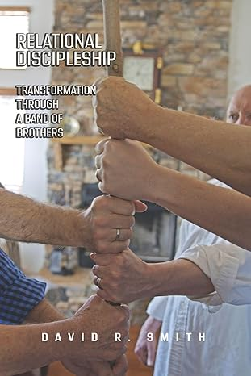

# Introduction: The Bridge from Knowing to Doing

There is a moment that every serious student of the spiritual life eventually reaches, and it is not a comfortable one. It is the moment when you realize that knowing a spiritual law is not the same as living in it.

I have been working on Volume 1 for over two decades. The explorations there — the logical relationships, the if-then structures, the causal laws, the structural maps of faith and hope and love and wisdom — are real. I believe them. I can state them with reasonable precision and ground most of them in scripture. And yet I have spent long stretches of my life where the channel was functionally closed, where I was hearing almost nothing, where the Word was coming in but producing very little fruit. The laws were true. My experience did not match. That gap is what this volume is about.

The governing premise of Volume 2 is simple: the laws discovered in Volume 1 are operational for a person whose channel is open, whose heart soil is in good condition, and whose community is functioning as designed. Most of us, most of the time, are not in that state. Not because we are bad people or weak believers, but because life does damage, and the damage accumulates, and unaddressed damage blocks hearing just as surely as a physical obstruction blocks a pipe.

I want to add one dimension to this framing that Eldredge consistently presses and that I think is simply true: the accumulation of damage is not merely the unfortunate result of a fallen world. The enemy actively works to keep those wounds unhealed and the agreements they produce firmly in place — because a believer who cannot hear is a believer who cannot act. The therapeutic work in Part II of this volume is also, therefore, spiritual warfare work. Clearing a grief knot or breaking a lie is not just emotional hygiene; it is reclaiming ground. That framing changes how you approach the tools.

Volume 2 is about getting the pipe clear and keeping it that way.

This is organized into three parts. Part I is diagnostic — what are the conditions that block hearing and faith? Part II is therapeutic — what tools, processes, and encounters with the Holy Spirit clear those blockages? Part III is developmental — what practices and community structures sustain and deepen the channel once it has been cleared?

Each exploration follows the same format as Volume 1: a clear causal law stated up front, scripture grounding, connection to the Volume 1 laws it enables or expresses, and the practical process that makes it experiential rather than merely conceptual. I stand on Principle 3 from Volume 1: these laws are knowable in all three worlds — spirit, mind, and body. If I only know them in my head, I have not yet known them.

A word about the tools and processes described in Part II. Many of them came to me through other people — Leanne Payne and Rita Bennett in inner healing, the Grief Recovery Handbook, Transformation Prayer Ministry, Wild at Heart, and the Band of Brothers work I have done with men over many years. I am not their originator; I am a practitioner who has seen them work. These processes are tested, many times in my life and the men I have been privileged to work with. Where I can, I point you to the source. What I am claiming is not that I invented the tools but that I have discovered, through experience, how they connect to the laws in Volume 1. That connection — between the practical tools and the underlying spiritual laws — is my contribution to the discussion.

Also, as I continue to edit and update this particular volume, I am so struck by the man-centric view presented, but that is my real experience. I’m not talking about things that I haven’t experienced, and mixed gender groups are rare in my personal experience, just because I have been focused on men’s work. My hope and desire is that major updates to this discussion will be done by women who have done the work, lived the life, internalized the Word, and are ready to share what God has given them. I’m looking forward to that.

Before I dive in, let me acknowledge two debts that deserve fuller recognition than a passing mention.

The first is to Dave Smith. Dave and I have walked through much of the experiential work described in this volume together. We have been a Band of Brothers for many years, using protocols derived from multiple sources and adapting what we could align faithfully with scripture. Dave has recently published a book documenting some of the processes we worked with: “Relational Discipleship: Transformation Through a Band of Brothers” (Dorrance Publishing). I recommend it without reservation to anyone who wants to follow the Band of Brothers trail more fully. His book is an important supplement to the discussion here.

Here is the link to the publisher of Dave’s book:

I highly recommend getting to know this book and Dave.

The second is John Eldredge. His books — particularly Wild at Heart (2001) and Waking the Dead (2003) — gave Dave and me scriptural grounding and encouragement at several critical points in the development of this work. Eldredge is working in a related field: the recovery of the heart’s design, the clearing of the wounds that suppress it, and the larger spiritual battle in which that recovery takes place. Where my framework tends toward the analytical and systematic, Eldredge’s tends toward the narrative and experiential. Both orientations are needed. My debt to him is not just for specific ideas — it is for the confidence that the interior work I was finding in men’s lives had scriptural roots and was being discovered by others in different contexts.

I want to be clear about what I am claiming when I reference Eldredge’s work in what follows. I am not claiming that Eldredge is the source of the laws I am proposing. The laws are drawn from scripture and confirmed through experience. Eldredge’s contribution is to have named certain dynamics in the masculine heart — the wound, the false self, the three core desires, the enemy’s strategy against the heart — with a clarity and accessibility that I have found repeatedly useful in both my own interior work and in working with other men. Where I reference him, I am saying: if you want more on this dynamic, and want it in a form that is grounded, accessible, and personally challenging, read Eldredge. He will get you there a different way than I will, and that is worth something.

**A Note on ****the Registry**** and Governance.** The explorations in this volume are encoded in vol2-claims.yml, with confidence ratings and dependencies on Volume 1 claims explicitly tracked. Most of the claims in this volume are Tier 2 working claims (65–80% confidence) under the Volume 6 governance, which is appropriate for material that is both genuinely practical and genuinely open to refinement as the testing program in Volume 4 returns results. The Heart Soil diagnostic and the Sin Blockage law are the Tier 1 anchor claims in this volume; the rest move by the normal governance rhythm of contribution, comment, and Council consent.
