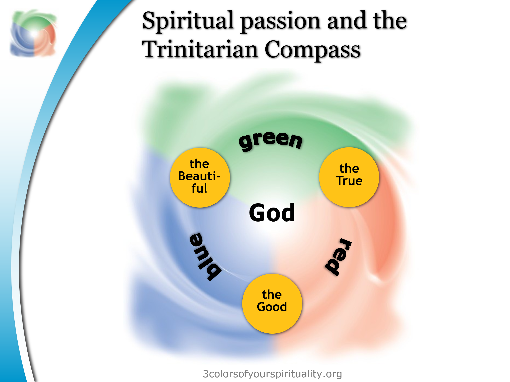

# Second Exploration: Transcendental Field Theory as the Vol 3 Framework

## What TFT Gives the IJH Project
When I first encountered the TFT framework, the experience was similar to what John Custer described from those early Saturday mornings: something clicked that I had been circling for a long time without quite reaching. TFT does not answer every question in Vol 3 — but it gives the Vol 3 project the formal framework I was reaching for but could not yet state.

The core of TFT: Truth (φ), Goodness (χ), and Beauty (η) are the three primary fields of the transcendental manifold. They are the fundamental degrees of freedom from which other spiritual realities are derived. The TFT Lagrangian treats these as the coordinate axes of a curved space, with coupling parameters α (Truth-Goodness), β (Truth-Beauty), and γ (Goodness-Beauty) determining the strength of their interactions. Additional transcendentals — Life, Light, Love, Glory, Holiness, Wisdom, Power, Peace, Justice, Unity, and Freedom — are not independent primary fields but derived fields, boundary conditions, coupling constants, or topological features of the manifold.

The most important TFT classification for the IJH project is this: Love is the meta-coupling constant — the binding energy that determines the strength of all interactions between the primary fields. Glory is the eschatological attractor — the fixed point toward which the entire field configuration evolves. Holiness is the boundary condition — the constraint that limits which regions of configuration space are accessible. And Being is the ground or vacuum state upon which all fields are defined.

I chose these three transcendental as the reference point mainly because I needed a starting point, and they have been part of philosophical discussions as aspects of the nature of God since such discussions were first recorded. Also, as I have mentioned before, the NCD approach is deeply attractive to me — and the reason it connects so precisely to TFT is worth stating explicitly, because it is not a superficial resemblance.

Christian Schwarz, the founder and president of NCD International, has spent thirty years building what he calls the Trinitarian Compass: a diagnostic framework that maps Christian growth and community health along three axes corresponding to Truth (the Father’s self-disclosure, the domain of doctrine and revelation), Goodness (the Son’s incarnation and moral formation, the domain of character and practice), and Beauty (the Spirit’s transforming work, the domain of encounter and communal life). These three axes are the same coordinate axes that TFT uses as its primary fields. This is not a metaphor I am borrowing from Schwarz — it is a structural convergence that I find genuinely striking, because we arrived at the same triad from different directions: he from ecclesial research and the Reformed-Evangelical-Charismatic tradition, I from my personal experience and the spiritual formation literature.

What makes Schwarz’s Trinitarian Compass unusual is that he does not treat it as a speculative framework. The NCD Church Survey has been administered to more than 70,000 churches across 84 countries and 112 denominations. That gives the transcendental triad an empirical database on a scale that philosophy alone cannot provide. Schwarz has done at the community and ecclesial levels what the IJH project is attempting at the individual and small-group levels: he has used the Truth-Goodness-Beauty structure as a measurement scaffold, not merely as a philosophical description.

His most recent work deepens this connection further. In the Energy Trilogy — three volumes published between 2021 and 2022 — Schwarz argues that the New Testament word family built on the Greek root energe- (energeia, energeo, energēma) has been systematically translated away in Western Christianity, losing the dynamic, operational sense of divine energy at work. This is directly relevant to Vol 3’s central ambitions: if the NT vocabulary itself carries the energy connotation that I have been trying to recover through a physics analogy, then the framework has stronger scriptural ground than I initially claimed. Integrating Schwarz’s tools fully into the IJH measurement scheme remains a future project — but it is now a high-priority one, not merely an interesting coincidence.

## How TFT Maps onto the Vol 1 and Vol 2 Laws
Vol 1’s Faith-Hope-Love triad now has a precise location in TFT’s framework: the three form a causal sequence (Faith → Hope → Love → Faith) that drives movement through the transcendental manifold toward the Glory attractor. Faith is the trust that orients my position toward the attractor; Hope is the forward-pull that sustains movement; Love is the meta-coupling that binds the movement to something outside myself.

Vol 1’s Wisdom cluster — Knowledge, Understanding, Wisdom, Discernment, with Fear of the Lord as the gateway — maps precisely onto TFT’s classification of Wisdom as the derived field W = αφχ, the Truth-Goodness synthesis. Fear of the Lord is not a separate element in TFT but the posture that keeps me properly oriented to the ground state, the vacuum upon which all field dynamics depend.

Vol 2’s emotional knots are, in TFT terms, local minima in the potential landscape — stable configurations of the transcendental fields that are not at the global minimum (Peace), and from which the system cannot escape without an external force (the ministry of the Holy Spirit). The valley imagery I used in Vol 2 essentially describes a potential well in the configuration space.

**TFT CONNECTION:  ***TFT’s “Distortion Manifolds” section is directly relevant to Vol 2’s heart soil explorations. When transcendentals misalign — Truth without Goodness, Power without Holiness, Freedom without Wisdom — specific characteristic pathologies result. These are Vol 2’s emotional knots described in the formal language of configuration space: movement away from the equilibrium submanifold toward unstable regions. Spiritual formation, therapy, and community correction are interventions that restore proper transcendental alignment.*

## The Primary Critique: Where TFT Must Be Held Loosely
I want to state the most important critique of TFT, because I think it points to where the IJH project needs to go that TFT has not yet gone.

TFT proposes a description of the static structure of the transcendental manifold: what the fields are, how they relate, what the attractor looks like, and where the boundary conditions lie. What it does not yet fully develop is the dynamics: the specific causal mechanisms by which a person actually moves through configuration space. It tells you what the landscape looks like, but not yet how the walker moves through it.

The IJH project has been doing the dynamics from Vol 1 forward: the Rom 10:17 chain is a dynamic statement (Word → Hearing → Faith → action). The Obedience Channel law is a dynamic statement (acting on prior revelation opens the channel for next revelation). The Emotional Knots law is a dynamic statement (unresolved wounds drain bandwidth, creating self-sustaining loops). TFT gives us the landscape; IJH gives us the walking. The two projects need each other.

The second critique: TFT’s use of quantum field theory as its formal language carries a risk that I want to name. QFT is a theory of infinitely many degrees of freedom in continuous spacetime. The spiritual world may be structured very differently. Using QFT’s mathematical architecture as more than an illustrative analogy would be premature. I am holding TFT’s field language as illustrative throughout this volume unless I explicitly flag otherwise.

A reader who remembers the AQAL critique in Volume 1 may ask why TFT fares better. The answer is not the physics analogy itself — both frameworks borrow structural language from science. The difference is the metaphysical ground. AQAL’s developmental framework is organized around the expanding self as its own center, with an eastern non-dual awareness at its apex. TFT’s framework is organized around the transcendentals as attributes of God, with Glory — the fullness of God’s own character — as the attractor. The physics language is scaffolding in both cases; what it is scaffolding is entirely different.

**Proposed Structural Law: The transcendental manifold — with Truth, Goodness, and Beauty as its primary coordinate axes, Love as the meta-coupling that binds all ****three, and Glory as the eschatological attractor — provides the formal landscape within which the ****IJH**** operational laws describe movement. TFT maps the terrain; the ****IJH**** laws describe what causes and sustains movement through it.**

**Certainty: 70****%  ***The** structural mapping is compelling and internally consistent. The specific mathematical forms (Lagrangian, coupling parameters) are illustrative analogies, not load-bearing equations at this stage. Confidence would increase with community testing and with the development of the measurement protocol for spiritual distance.*

**VOL 1 CONNECTION:  ***The transcendental manifold described here is the formal landscape within which the Vol 1 structural laws are located. Vol 1’s Faith-Hope-Love triad (Vol 1, Exp. 3) now has a precise location in Truth-Goodness-Beauty space: Faith aligns with Truth, Love aligns with Goodness, and Hope (the forward orientation that Love enables) aligns with the Beauty of the not-yet-realized. Vol 1’s Wisdom cluster (Vol 1, Exp. 4) maps onto TFT’s framework as the derived faculty that navigates the configuration space correctly.*

**FORMATION DOCUMENT CONNECTION: ***SST’s spirit taxonomy provides a developmental account of movement through the Truth-Goodness-Beauty configuration space that TFT maps as the formal landscape. Spirit Stage 1 (Indwelling Received) is the entry condition — not a movement within the space but the moment the person becomes capable of movement at all, analogous to the nested person structure’s innermost layer becoming activated. Spirit Stages 2–4 describe progressive deepening into the space: cooperation, fruitfulness, and contemplative union are not random walks but movements with direction and increasing proximity to the Glory attractor. Spirit Stage 5 (Fullness of God) names Eph. 3:19 — filled with all the fullness of God — as the maximal creaturely participation in the divine life possible in the present age, with consummation awaiting the resurrection. That is precisely what TFT means by the Glory attractor as an eschatological horizon: reachable in partial form in the present age, consummated beyond it.*

**PART II**

*The Elemental Quantities: Force, Distance, Energy, Power*

**Vol 3 — Exploration 3 — Analytical Core**
