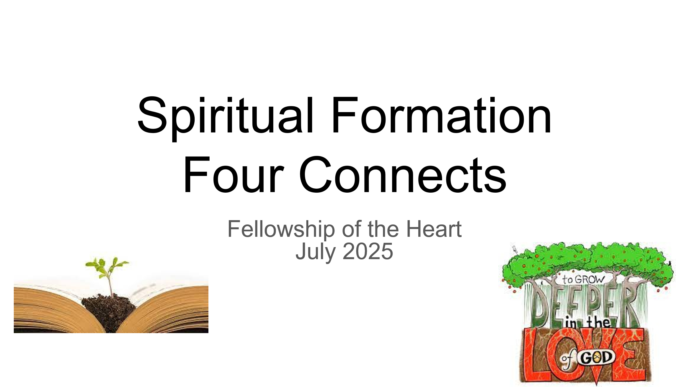

# References

In addition to the references carried forward from TA, HFT, SST, and MSFIG (all in Vol 5), this paper draws on the following for the mode-specialization and credentialing content:

- Barry, C. (1993 and subsequent). Shadow Work Seminars facilitator training curriculum. Mendocino, CA: Shadow Work Seminars.
- Bilgere, D. (2013). Gateways to God. Self-published, later integrated with Christian inner healing practice. [Already in Vol 5.]
- Bennett, R. (1984 and subsequent editions). Emotionally Free. Old Tappan, NJ: Chosen Books. [Already in Vol 5.]
- Eldredge, J. (2001, 2010, 2018). Wild at Heart and subsequent works on masculine spirituality and the Band of Brothers framework. Nashville: Thomas Nelson. [Already in Vol 5.]
- Haugk, K. C. (1984, 2000). Stephen Ministry training system and Leader's Manual. St. Louis: Stephen Ministries.
- Ignatius of Loyola (c. 1548). The Spiritual Exercises. Multiple modern editions. [Already in Vol 5 through secondary sources.]
- Kylstra, C., & Kylstra, B. (1994, subsequent editions). Restoring the Foundations. Cedar Hill, TN: Proclaiming His Word Publications.
- Nemeck, F. K., & Coombs, M. T. (1985). The Way of Spiritual Direction. Collegeville, MN: Liturgical Press. [Already in Vol 5.]
- Payne, L. (1991, subsequent editions). Restoring the Christian Soul Through Healing Prayer. Grand Rapids: Baker Books. [Already in Vol 5 through Pastoral Care Ministries references.]
- Smith, E. (1999, subsequent editions). Transformation Prayer Ministry training curriculum (historically Theophostic Prayer Ministry). Campbellsville, KY: Alathia Publishing.
- Spiritual Directors International. (Ongoing). Guidelines for the Ethical Conduct of Spiritual Directors; accreditation standards for training programs.
- Stone, H., & Stone, S. (1989). Embracing Our Selves: The Voice Dialogue Manual. San Rafael, CA: Nataraj Publishing.
- Tittle, J. G. (2026). Weapons Master Discussion, v4. Unpublished working paper, Fellowship of the Heart / Band of Brothers workshop materials.
- Trotman, D. (various). Navigators training materials; Topical Memory System (TMS); 2:7 Series. Colorado Springs: NavPress.
## A Four Connects Workshop as an Introduction and Invitation to an Intentional Journey of the Heart
The following workshop materials are included here not as part of any single Formation Document but as a practical on-ramp for groups beginning to explore the Intentional Journey of the Heart framework. They complement the Four Connects architecture developed in Vol 2, Exp. 5, and the Companion practice described in FC. A group that wants to use these materials does not need to have worked through the Formation Documents in advance; the workshop is designed to introduce the framework experientially and to leave participants with enough of a shared vocabulary to engage the volumes afterward if they choose to.

